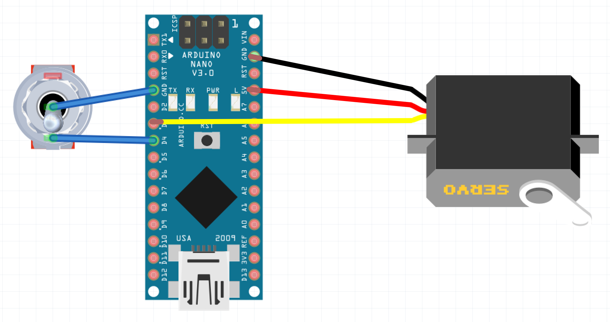

# Sliding Mirror

For use in alternating between two beams in a microscopy setup. A mirror is moved into position with high reposition accuracy. It has been tested on lasers with path lengths ~4.5m and found to allow better repeatability than for example a ThorLabs flip mirror. It also has the advangtage of optionally being automated.
A translation stage is used to provide the linear translation whilst movement is generated by a servo. A spring couples the servo arm to the stage, allowing the stage to be held tight against one end of its range to ensure the same position every time.

Could also be used to add/remove other components e.g. lenses, from optical path where high positional accuracy is needed.

The design comes in two sizes, based around the 13mm and 25mm translation stages available from ThorLabs. 25mm is easier to set-up and allows space for multiple optical components on the stage, whilst 13mm has a smaller footprint. If using the 13mm, then the 'edgeless' mirror design may be useful.

The designs assume mounting on an optical breadboard with 25mm spacing for M6 bolts.

## Bill of Materials

Part | Number | Product Code | Company | Cost (Aprox. GBP)
---|---|---|---|---
Translation Stage 25mm (or 13mm) | 1 | PT1B/M (MT1B/M) | ThorLabs | 161.42 (167.54)
Mirror mount   | 1   | application specific | -  |  -
M6 screw | 1 pack | SH6MS20 | ThorLabs | 6.66
Servo  | 1 | 781-3058 | RSonline | 11.06
Wires  |  1   | 214-0661 |  RS Online   | 14.29
Switch | 1 | 734-7154 | RS Online | 2.33
USB cable   | 1   | 121-6574   | RS Online  |  2.41
Arduino nano (or similar)  |  1  |  1050-1001-ND | Digi-Key  |  16.66
Spring | 1 pack |  2444377 | Farnell | 6.87
Machine screws | 1 pack | 560-596 | RS Online | 2.39

## Assembly
* Print the 3D part using at least 50% infill
* Remove three of the four servo arms and attach to the servo.
* Attach the servo to the base with M3 screws
* Remove the plug from the servo, then solder the wires to the Arduino Nano as shown in the wiring diagram below
    * Red to 5V*
    * Black to Ground
    * Yellow to any PWM (pin D3,5,6,9,10 or 11)
    * Switch wire one to Ground
    * Switch wire two to Digital pin e.g. D4
**The servo can draw 140mA, which is comfortably handled by the arduino and the USB supply from a computer*

* Mount the arduino on the side of the servo with hot glue for convenience
* Attach the 3D printed part to the breadboard using an M6 screw. If working along the 90 degree angles of the board then two screws can be added. In the example shown a 45 degree angle is used, and only one screw is added. A second screw hole is provided on the 25mm version to ensure a neat 45 degree angle is made.
* Use an extension spring, bending the ends as needed to connect the stage to the servo arm. The 13mm design has a screw hole that is used as a mount point for the sprnig, whilst the 25mm version has an additional 3D printed part to act as the mount point.
* The switch can be mounted somewhere more convenient for manual adjustment of the position.
* Attatch the USB wire to supply power, and also for automated control.

## Software

The provided  can be uploaded to the board by following the instructions to  and .

The software makes use of the  to control the mirror position.

## Use

The software is designed to move the servo arm slowly, quick movements cause impact against the ends of the linear stage and the vibration produced can cause changes to mirror positions.

